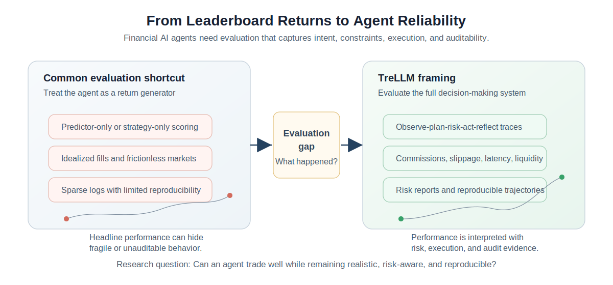
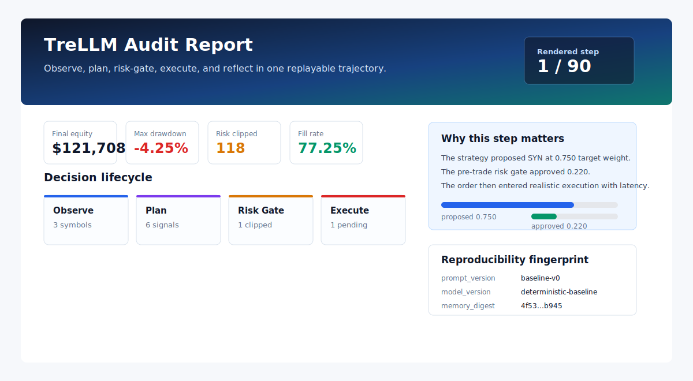
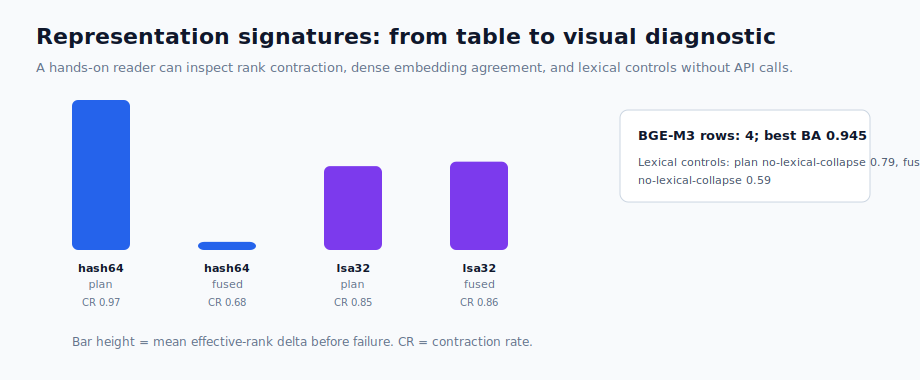
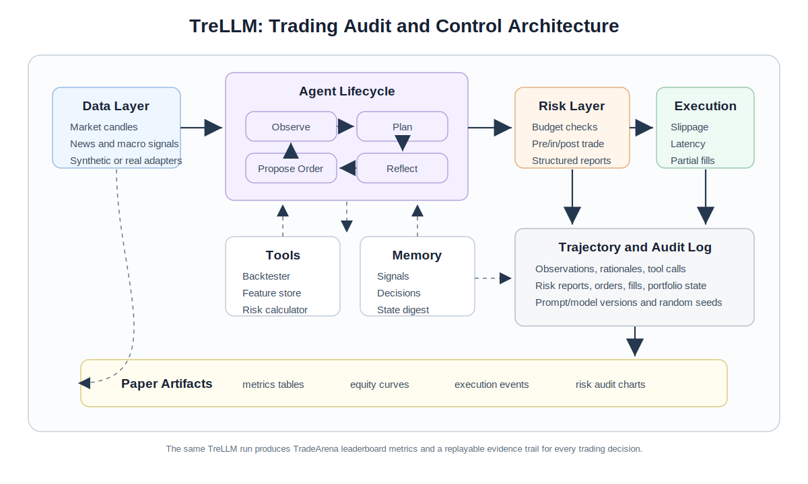

<p align="center">
  
</p>

<p align="center">
  <strong>Modular, execution-realistic, risk-aware benchmarks for LLM trading agents.</strong>
</p>

<p align="center">
  <a href="docs/getting_started.md">Getting started</a> |
  <a href="docs/demo_matrix.md">Demo matrix</a> |
  <a href="examples">Hands-on examples</a> |
  <a href="#visual-tour">Visual tour</a> |
  <a href="#research-grade-diagnostics">Diagnostics</a> |
  <a href="docs/schemas.md">Schemas</a> |
  <a href="docs/plugin_interfaces.md">Plugin interfaces</a>
</p>

<p align="center">
  
  
  
  
</p>

# TradeArena

TradeArena is a modular framework for studying trading agents as auditable
decision-making systems under realistic market constraints. It focuses on the
full lifecycle of a trading decision: observations, signals, intended weights,
risk-gate changes, orders, fills, slippage, rejected orders, memory events, and
replayable trajectory logs.

This public repository is the framework and demo release.



## Visual Tour

The fastest way to understand TradeArena is to watch the decision loop. These
short, API-free previews are generated from the same concepts used by the
examples: lifecycle logging, execution realism, risk feedback, and portfolio
diagnostics.

| Audit lifecycle | Execution realism | Diagnostic loop |
| --- | --- | --- |
|  |  |  |

The visual tour is deliberately small enough for a README, while the underlying
artifacts are real files produced by the repository demos and diagnostic
snapshots.

## Audit Report Preview

TradeArena records every step as an auditable trajectory rather than hiding the
agent inside a return curve. The rendered report links observations, analyst
signals, proposed and approved decisions, risk-gate edits, submitted orders,
fills, rejections, portfolio state, memory events, and reproducibility
fingerprints in one browser-readable artifact.

<p align="center">
  
</p>

Generate the same style of report locally:

```bash
python examples/audit_trajectory_walkthrough.py
python scripts/render_audit_report.py
```

Open:

```text
outputs/examples/audit_report.html
```

## Research-Grade Diagnostics

TradeArena is more than a toy backtester: the repository includes tracked,
API-free diagnostic artifacts produced by the same trajectory, risk, execution,
and evaluation interfaces used by the framework. These examples show how an
agent's decision path can be inspected as a system object rather than reduced
to a final return number.

The current diagnostic suite highlights three research axes:

- representation signatures before agent failure
- risk-feedback alignment under true, hidden, placebo, and contrarian feedback
- mechanism probes for noise robustness, reasoning-mode ablations, and false
  audit trust calibration
- high-dimensional portfolio behavior under realistic execution constraints

| Representation signature preview | Crisis-scene trajectory probe |
| --- | --- |
|  |  |

| Market correlation vs. LLM intent | Risk-feedback calibration |
| --- | --- |
|  |  |

| Mechanism probe dashboard | 51-stock intraday portfolio probe |
| --- | --- |
|  |  |

The crisis-scene probes use timestamp-masked historical stress paths, including
a 2022 Tech/Rates drawdown scene and a 2023 SVB/regional-bank shock scene. The
tracked snapshots include redacted model metadata for GPT-family, Gemini,
Claude, and DeepSeek V4 Pro runs without shipping raw provider prompt/response
text.

The mechanism probe dashboard summarizes three stress tests that are useful for
agent evaluation: CoT-free intent geometry, noise-injection robustness, and
contrarian false-audit drift. The 51-stock intraday probe compares passive,
Markowitz/MVO, and LLM allocation behavior under a high-dimensional hourly
portfolio task, exposing concentration, risk-gate pressure, and execution-aware
return differences in a single view.

Run the gallery locally:

```bash
python examples/crisis_snapshot_demo.py
```

Open:

```text
outputs/examples/crisis_snapshot_gallery.html
```

Numeric snapshots live under [`docs/results/crisis`](docs/results/crisis) and
[`docs/results/representation`](docs/results/representation). They are small
enough to track in Git and concrete enough for new users to reproduce the
visual diagnostics without spending API credits.

## One-Command Showcase

```bash
python -m pip install -e ".[dev]"
python scripts/run_showcase.py
```

Open:

```text
outputs/examples/showcase.html
```

The showcase is API-free. It builds a local portal linking to:

- an auditable trajectory report
- an execution-realism sweep
- A-share market-rule interventions
- crisis-scene visual diagnostics
- Markowitz/MVO portfolio baselines
- representation-signature diagnostics
- a custom plugin extension example
- redacted LLM cache manifest metadata

## Quick Start

```bash
python -m pip install -e .
tradearena --benchmark tradearena-core
```

Without installing:

```powershell
$env:PYTHONPATH='src'
python -m trading_agent_os.cli --benchmark tradearena-core --periods 60 --symbols SYN,ALT
```

## Architecture

```text
Data Layer
  OHLCV market data, synthetic/proxy news and macro,
  optional CSV sidecars for news, macro, filings, and alternative data

Agent Layer
  analyst agents, strategy agents, risk managers, execution agents,
  portfolio managers

Tool Layer
  backtester, feature store, portfolio optimizer, risk calculator,
  realistic order simulator

Risk Layer
  RiskBudget, pre-trade gate, in-trade monitor, post-trade attribution,
  violation logging, structured RiskReport logs

Logging and Evaluation Layer
  trajectories, audit manifests, return metrics, risk metrics,
  behavioral metrics, execution realism metrics, reasoning consistency
```



## Hands-On Examples

```bash
python examples/quickstart_core_benchmark.py
python examples/audit_trajectory_walkthrough.py
python scripts/render_audit_report.py
python examples/execution_realism_sweep_demo.py
python examples/portfolio_markowitz_demo.py
python examples/custom_plugin_demo.py
```

See [`examples/README.md`](examples/README.md) and
[`docs/demo_matrix.md`](docs/demo_matrix.md) for the full demo map.

## Data Adapters

TradeArena's stable data boundary is normalized OHLCV CSV:

```text
Data source -> Date,Open,High,Low,Close,Volume CSV -> CsvMarketDataProvider
```

A-share data can be downloaded through the optional AkShare bridge:

```bash
python -m pip install -e ".[ashare]"
python scripts/download_akshare_ashare_daily.py --symbols 600519.SS,300750.SZ --start 2021-01-01 --end 2026-05-14 --output-dir data/real/akshare_ashare_daily
```

Then reuse the same benchmark stack:

```bash
python -m trading_agent_os.cli --benchmark tradearena-core --data-source csv --real-data-dir data/real/akshare_ashare_daily --symbols 600519.SS,300750.SZ --real-max-periods 80
```

## LLM And Cache Policy

Live model calls are optional. The API-free demos use deterministic agents,
tracked market data, and redacted cache manifests. If you run live model-backed
experiments, raw prompt/response JSONL caches are ignored by Git:

```text
data/llm_cache/*.jsonl
```

Build shareable redacted manifests with:

```bash
python scripts/build_llm_cache_manifest.py
```

## Development Direction

TradeArena is designed to grow through plugins and benchmarks rather than a
single fixed pipeline. Near-term extension areas include:

- more data bridges for equities, A-shares, crypto, prediction markets, news,
  filings, macro, and alternative data
- richer execution simulators, including limit-order-book style queues,
  corporate-action calendars, venue-specific rules, and stress liquidity
- stronger baseline libraries spanning deterministic policies, Markowitz/MVO,
  reinforcement learning, and model-backed agents
- broader risk protocols covering pre-trade gates, in-trade monitors,
  post-trade attribution, human audit labels, and adversarial feedback tests
- community benchmark tasks with shareable redacted trajectories and compact
  result manifests

## Contributing

Start with [`examples/custom_plugin_demo.py`](examples/custom_plugin_demo.py) if
you want to add a new analyst, strategy, risk gate, simulator, memory store, or
metric. See [`CONTRIBUTING.md`](CONTRIBUTING.md).

Before opening a pull request:

```bash
python -m compileall src scripts examples tests -q
python -m pytest tests -q
python scripts/run_showcase.py --reuse-existing
```

## Disclaimer

TradeArena is a research and engineering framework. It is not financial advice,
and it is not a live trading system.
