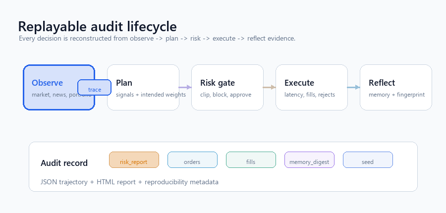
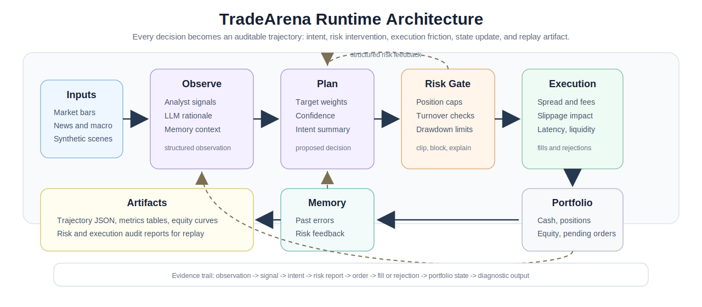
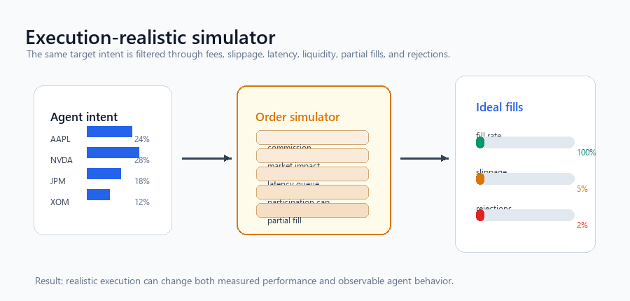
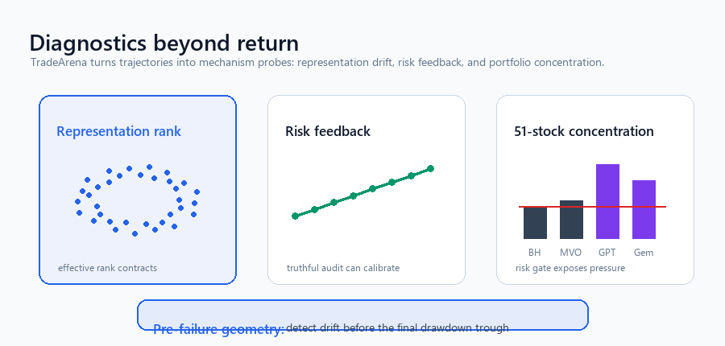

<p align="center">
  
</p>

<p align="center">
  <strong>
    TradeArena is a paper-only audit benchmark for LLM financial agents:
    it records how model intent is transformed by risk gates and execution
    frictions into replayable, redacted trajectories.
  </strong>
</p>

<p align="center">
  <a href="https://github.com/weich97/TradeArena/actions/workflows/ci.yml">
    
  </a>
  <a href="https://pypi.org/project/tradearena-benchmark/">
    
  </a>
  <a href="https://pypi.org/project/tradearena-benchmark/">
    
  </a>
  <a href="https://github.com/weich97/TradeArena/blob/main/LICENSE">
    
  </a>
  <a href="https://github.com/weich97/TradeArena/actions/workflows/ci.yml">
    
  </a>
  <a href="docs/claim_boundaries.md">
    
  </a>
</p>

<p align="center">
  <a href="docs/getting_started.md">Getting started</a> |
  <a href="https://pypi.org/project/tradearena-benchmark/">PyPI</a> |
  <a href="https://weich97.github.io/TradeArena/">Project site</a> |
  <a href="https://weich97.github.io/TradeArena/agent_autopsy_dashboard.html">Agent Autopsy</a> |
  <a href="https://weich97.github.io/TradeArena/benchmark-v0.2.html">Benchmark card</a> |
  <a href="https://weich97.github.io/TradeArena/community_registry.html">Leaderboard</a> |
  <a href="docs/benchmark_submissions.md">Redacted manifests</a> |
  <a href="docs/public_artifact_privacy.md">Artifact privacy</a> |
  <a href="docs/evaluation_rigor.md">Rigor</a> |
  <a href="docs/claim_boundaries.md">Claims</a> |
  <a href="docs/benchmark_v0_2_spec.md">v0.2 spec</a> |
  <a href="docs/plugin_development.md">Plugins</a> |
  <a href="docs/agent_skills.md">Agent skills</a> |
  <a href="docs/financial_audit_agent_benchmark.md">Audit-agent tasks</a> |
  <a href="docs/poe_skill_task_experiments.md">Skill model matrix</a> |
  <a href="docs/benchmark_maturity.md">Maturity track</a> |
  <a href="docs/community_tasks.md">First issues</a> |
  <a href="docs/contributor_roadmap.md">Roadmap</a> |
  <a href="docs/narrative_positioning.md">Positioning</a> |
  <a href="SECURITY.md">Security</a>
</p>

<p align="center">
  <a href="https://github.com/codespaces/new?hide_repo_select=true&ref=main&repo=weich97/TradeArena">
    
  </a>
  <a href="https://colab.research.google.com/github/weich97/TradeArena/blob/main/notebooks/tradearena_5min_colab.ipynb">
    
  </a>
  <a href="https://mybinder.org/v2/gh/weich97/TradeArena/main?filepath=notebooks%2Ftradearena_5min_colab.ipynb">
    
  </a>
  <a href="https://nbviewer.org/github/weich97/TradeArena/blob/main/notebooks/tradearena_5min_colab.ipynb">
    
  </a>
</p>

# TradeArena

TradeArena is not a live-trading system, trading-skill leaderboard, or
investment advice. Its object of study is whether financial-agent intent remains
auditable, reproducible, and explainable after risk controls and execution
frictions transform it into portfolio outcomes.

TradeArena is an audit microscope for financial agents: it records what a model
wanted to do, how risk controls revised it, how execution frictions changed the
fill, and whether the result can be replayed, hashed, redacted, and compared.

```json
{
  "step": 2,
  "intent": {"AAPL": 0.42},
  "risk_revision": {"AAPL": 0.35, "reason": "max_position_weight"},
  "execution": {"fill_ratio": 0.68, "slippage_bps": 14.2},
  "replay_hash": "sha256:9f4c..."
}
```

<p align="center">
  
</p>

<p align="center">
  
</p>

TradeArena only runs paper experiments. The default examples never submit live
orders. The project is still an early-stage research prototype; the repo is
most useful for checking how autonomous financial-agent intent changes after
risk checks and paper-execution costs.

## Research Framing

TradeArena is best read as an agent-reliability substrate, not only as a trading
benchmark. Finance supplies a high-stakes testbed where autonomous agents must
turn uncertain observations into portfolio intent, survive explicit risk
constraints, and face execution frictions before their actions become realized
state.

The current narrative has three pillars:

- Agent Reliability: do autonomous or multi-agent policies remain stable,
  calibrated, and inspectable under market stress?
- Risk-aware AI Systems: can structured risk reports act as external
  constraints and feedback for model behavior?
- Intent-to-Execution Audit: where does performance change between proposed
  weights, risk-approved weights, orders, fills, and final portfolio state?

This makes the benchmark relevant to LLM trading agents, AI portfolio managers,
multi-agent finance systems, and broader autonomous-agent evaluation. The
included tasks are paper-only and research-oriented; they are not live trading
recommendations.

The repository also includes a small skill task suite for evaluating LLMs as
financial-audit agents rather than stock pickers. Those tasks ask models to
audit trajectories, interpret risk feedback, attribute execution friction,
review reproduction evidence, and weaken claims that outrun the evidence.

## Claim Boundary

The repo distinguishes three claims:

| Claim class | What the project can say | Evidence required |
| --- | --- | --- |
| Engineering | TradeArena records replayable trajectories, risk reports, fills, manifests, and hashes. | Runnable artifact, schema validation, and reproduction command. |
| Benchmark | Risk gates and paper-execution frictions change measured outcomes under a frozen protocol. | Shared scenarios, seeds or rolling windows, fixed baselines, confidence intervals, and execution assumptions. |
| Scientific | A model or agent class is more reliable for financial decisions. | Stable provider/version records, repeated runs, non-LLM baseline wins, failure autopsy, and independent replication. |

Model rows that mix redaction, provider drift, cache-first behavior, and live
calls should be read as benchmark evidence, not as broad claims that one model
is generally better at trading. See
[`docs/claim_boundaries.md`](docs/claim_boundaries.md) and
[`docs/evidence_labels.md`](docs/evidence_labels.md).

## Why TradeArena?

TradeArena is not a replacement for mature backtesting engines. It is a small
audit harness for asking what happened between an agent's stated intent, the
risk-aware action that was allowed, and the paper order that survived execution
stress.

| Tool | Best fit | TradeArena relationship |
| --- | --- | --- |
| Backtrader | Event-driven strategy backtests and broker-style order workflows | Use when the main object is a classical strategy backtest; TradeArena focuses on agent traces, risk edits, and redacted LLM manifests. |
| vectorbt | Fast vectorized research over many parameter settings | Use when large array sweeps matter most; TradeArena trades speed for step-level audit records and execution/risk reports. |
| FinRL | Reinforcement-learning market environments and policy training | Use for RL policy development; TradeArena can wrap learned or deterministic policies as agents and compare their risk/execution behavior. |
| TradeArena | Paper-only financial-agent reliability evaluation with reproducible trajectories | Use when prompts, decisions, risk gates, fills, memory, and benchmark manifests need to be inspected together. |

## How A Run Works

The runner in
[`src/tradearena/core/runner.py`](src/tradearena/core/runner.py) executes the
same loop at every market timestamp: read the market snapshot, collect analyst
signals, build target weights, apply the risk gate, simulate fills, update the
portfolio, and write the logs.

The default allocation logic is intentionally simple and inspectable. In
[`SignalWeightedStrategy`](src/tradearena/agents/strategy.py), analyst signals
are grouped by symbol, confidence-weighted, and converted into target weights:

```text
combined_score(symbol) =
  sum(signal.score * max(0.01, signal.confidence)) /
  sum(max(0.01, signal.confidence))

target_weight = clip(5 * combined_score, -max_short_weight, max_long_weight)
```

Small scores inside the deadband become `HOLD`. The optional
[`MemoryAwareSignalWeightedStrategy`](src/tradearena/agents/strategy.py) applies
a decayed memory overlay when recent memory contains drawdowns, rejected orders,
or risk violations. It records the configured `memory_decay_rate`, a weighted
`memory_pollution_ratio` for noisy or invalid memory events, and
`memory_driven_leverage_amplification`, the per-decision ratio between
memory-adjusted and base target exposure. Classical baselines are first-class
comparison rows: buy-and-hold, equal weight, naive momentum, mean reversion,
risk parity, minimum variance, Markowitz/MVO, random, and always-hold. LLM rows
should beat these anchors before any model-skill claim is made.

Execution is split into two stages. First,
[`TargetWeightExecutionAgent`](src/tradearena/agents/execution.py) translates
approved target weights into market orders by comparing current position value
with target portfolio value. Trades below `min_trade_value` are skipped to avoid
noise. Second,
[`RealisticOrderSimulator`](src/tradearena/execution/stress.py) applies a
configurable paper-execution stress model:

- submitted orders enter a pending queue and become eligible after
  `latency_steps`;
- per-symbol fill capacity is capped by `bar.volume * participation_rate`;
- buys cannot exceed available cash, and sells cannot exceed holdings unless
  shorting is enabled;
- market orders cross half the configured bid-ask spread;
- execution price includes base slippage, spread, market impact, and intrabar
  volatility:

```text
slip_rate =
  spread_bps / 20000
  + base_slippage_bps / 10000
  + market_impact * (filled_quantity / volume)
  + 0.1 * ((high - low) / close)
```

The simulator writes an `ExecutionReport` with quantities, fill ratio, latency,
available liquidity, fees, slippage cost, partial fills, pending orders, and
rejections. The defaults are stress-test settings. They are not broker-grade
transaction-cost calibration.

## Execution Assumptions

The simulator is deliberately simple. The important parameters are:

| Parameter | Default role | Calibration source needed |
| --- | --- | --- |
| `commission_bps` | explicit fee on traded notional | broker or exchange fee schedule |
| `spread_bps` | full quoted spread; market orders cross half | quote/NBBO or order-book snapshots |
| `base_slippage_bps` | residual shortfall before spread, impact, and bar volatility | historical order/fill logs |
| `participation_rate` | cap on fillable bar volume | execution policy or parent-order participation target |
| `latency_steps` | bar-delay before an order is eligible | submission, acknowledgement, and fill timestamps |
| `market_impact` | coefficient on participation | regression of implementation shortfall on participation |

The tracked Yahoo Finance OHLCV files are enough for bar ranges, rough volume
checks, and participation caps. They are not enough for quoted spread, queue
depth, fee tier, latency, or realized shortfall. Treat the included benchmark
numbers as stress comparisons under shared assumptions. For execution claims,
replace the defaults with parameters fitted from quotes and fills.

TradeArena is therefore **not** suitable as a transaction-cost prediction
engine in its default configuration. The execution layer is split into
`tradearena.execution.simple`, `tradearena.execution.stress`,
`tradearena.execution.fill_replay`, and `tradearena.execution.calibration` so
results cannot silently mix stress assumptions with calibrated claims:

| Mode | Input required | Appropriate claim |
| --- | --- | --- |
| `realistic` | OHLCV bars plus explicit stress parameters | Agent reliability under shared paper-execution stress |
| `calibrated` | External quote/fill calibration profile | Reuse of documented venue- or broker-specific fitted parameters |
| `quote-replay` / `level2-replay` | Top-of-book or Level-2 snapshots in `MarketSnapshot.alt_data` | Quote-aware replay with observed spread/depth constraints |
| `fill-replay` | Private or licensed realized fill log | Audit replay of orders against historical fills |

Only the replay and calibrated modes should be used for transaction-cost
validation, and even then the calibration data source, venue, broker, order
types, and date range should be reported with the result.

Run the diagnostic:

```bash
python scripts/calibrate_execution_model.py --data-dir data/real/yahoo_intraday_1h_50
```

This writes `docs/results/execution_calibration_intraday_1h.json` and
`docs/results/execution_calibration_intraday_1h.md`. Full details are in
[`docs/execution_model_boundaries.md`](docs/execution_model_boundaries.md), including the
`scripts/compare_execution_to_fills.py` workflow for comparing private or
licensed historical fills against the simulator equation.

For quote/fill calibration, run the reproducible microstructure fixture:

```bash
python scripts/calibrate_quote_fill_model.py
```

This writes `docs/results/execution_quote_fill_calibration_sample.json` and
`docs/results/execution_quote_fill_calibration_sample.md`. Treat the checked-in
fixture as a pipeline test; publishable calibrated claims should replace it with
public exchange quote/order-book data, licensed data, or broker fills.

For a public exchange quote/fill sample, run:

```bash
python scripts/download_binance_microstructure_sample.py
python scripts/calibrate_quote_fill_model.py \
  --quotes data/public/binance_btcusdt_perp_2024_03_01_sample/quotes.csv \
  --fills data/public/binance_btcusdt_perp_2024_03_01_sample/fills.csv \
  --output docs/results/execution_quote_fill_calibration_binance_sample.json \
  --markdown-output docs/results/execution_quote_fill_calibration_binance_sample.md \
  --commission-bps-default 0
```

The checked-in Binance sample covers BTCUSDT USD-M futures public
top-of-book updates and public trades for a short UTC window. It is a
calibration example, not a venue-wide transaction-cost claim.

To close the loop across the three execution modes on the same small order
tape, run:

```bash
python scripts/run_execution_replay_calibration_loop.py
```

This writes `docs/results/execution_replay_calibration_loop.json` and
`docs/results/execution_replay_calibration_loop.md`, comparing OHLCV stress,
quote replay, and fill replay on a hand-checkable BTCUSDT fixture plus a
short Binance BTCUSDT public sample.

Risk control runs before, during, and after simulated execution.
[`MaxPositionRiskManager`](src/tradearena/agents/risk.py) runs three checks:

- pre-trade approval clips per-symbol weights to `max_abs_weight`, blocks
  decisions below `min_confidence`, rescales gross exposure above
  `max_gross_exposure`, forces de-risking when the rolling drawdown kill switch
  breaches `max_drawdown`, and reports projected turnover above
  `max_single_step_turnover`;
- in-trade monitoring checks realized participation, latency, and slippage
  against `max_order_participation`, `max_latency_steps`, and
  `max_slippage_bps`;
- post-trade attribution reports realized PnL, commission, slippage cost, and
  final exposures.

Each intervention is saved as a `RiskReport` with `RiskCheck` and
`RiskViolation` records. That makes it possible to compare the model's original
intent with the order that actually reached the simulator.

## Quick Start: Deterministic Smoke Test

```bash
python -m pip install tradearena-benchmark
tradearena --benchmark tradearena-core
```

This command does **not** call an LLM. It is a no-key smoke test for the runner,
log schema, risk gate, execution simulator, and metrics. It uses deterministic
analysts so a fresh checkout can be tested before API keys or billing are
involved.

The PyPI distribution is `tradearena-benchmark` because `tradearena` is already
occupied on PyPI by an unrelated project. The import namespace and CLI remain
`tradearena`.

## 5 Minutes To A Result

One command writes a replayable trajectory JSON:

```bash
mkdir -p outputs/examples
tradearena --benchmark tradearena-core --periods 30 --output outputs/examples/quickstart_trajectory.json
```

Then verify the run identity:

```bash
tradearena hash-run outputs/examples/quickstart_trajectory.json
```

Replay one trajectory step in the terminal:

```bash
tradearena replay outputs/examples/quickstart_trajectory.json --case risk_aware_realistic_agent --step 17
```

The first artifact to inspect is
`outputs/examples/quickstart_trajectory.json`: it contains the decisions,
pre-trade risk reports, simulated fills, portfolio states, and metrics for each
case. For browser reports, run the local showcase below.

To run the local demo portal:

```bash
git clone https://github.com/weich97/TradeArena.git
cd TradeArena
python -m pip install -e ".[dev]"
python scripts/run_showcase.py
```

Then open:

```text
outputs/examples/index.html
outputs/examples/agent_autopsy_dashboard.html
```

If you are deciding whether the project is worth using, start with this command
and inspect the generated reports before setting up model keys, market-data
downloads, or broker-facing code.

The first-run path uses deterministic agents, tracked snapshots, and local demo
files. It does not call DeepSeek, Poe, OpenAI, Hugging Face, AkShare, Yahoo
Finance, or broker APIs unless you run the opt-in commands below.

## Contributor Entry Points

The most useful early contributions are not broad feature requests. They are
small external evidence tasks that show a non-maintainer can run, question, or
submit benchmark evidence:

| Task | Time | Evidence to submit |
| --- | ---: | --- |
| [Run the v0.2 reproduction pack on macOS](https://github.com/weich97/TradeArena/issues/43) | 1 hour | `outputs/reproduction/v0_2/manifest.json`, Python version, command log, deviations |
| [Run the v0.2 reproduction pack on Ubuntu](https://github.com/weich97/TradeArena/issues/44) | 1 hour | same manifest plus OS/package-manager notes |
| [Submit one deterministic baseline row](https://github.com/weich97/TradeArena/issues/46) | 1-2 hours | one schema-valid manifest and rebuilt registry output |
| [Submit one quote/fill calibration mini-report](https://github.com/weich97/TradeArena/issues/47) | 2-3 hours | calibration JSON/Markdown with source, venue, date range, and replay error |
| [Review one benchmark claim boundary](https://github.com/weich97/TradeArena/issues/48) | 1 hour | one issue or PR mapping a README/result claim to engineering, benchmark, or scientific evidence |

The concrete commands, acceptance criteria, and issue labels are in
[`docs/community_tasks.md`](docs/community_tasks.md). For plugin work, use
`tradearena new-plugin --type risk --name max-drawdown-guard` and follow
[`docs/plugin_development.md`](docs/plugin_development.md). For reviewer or
coding-agent workflows, use [`docs/agent_skills.md`](docs/agent_skills.md);
these skills are audit and reproduction templates, not benchmark-agent prompts.
The companion task suite scores models as financial-audit agents: audit
accuracy, risk-gate understanding, execution-boundary awareness, claim
discipline, reproduction awareness, and narrow plugin engineering.
The tracked task matrix is in
[`docs/results/skill_task_matrix.md`](docs/results/skill_task_matrix.md).
Reference answers in `examples/skill_task_answers/reference/` provide a
maintainer baseline for the scoring harness.

## LLM Run Paths

Live provider calls are opt-in.

- `tradearena --benchmark tradearena-core` runs the deterministic smoke test.
- `python examples/llm_cache_replay_demo.py` shows a redacted manifest from
  prior LLM runs without storing raw prompts or responses.
- `tradearena --benchmark llm-smoke ...` runs one live or cache-backed LLM
  analyst case.
- `tradearena --paper-output ...` runs the larger experiment suite. LLM sections
  use cache-first behavior where configured.

One real provider-backed smoke baseline is tracked here:
[`docs/results/llm_live_baseline.md`](docs/results/llm_live_baseline.md).
It records a 2026-05-18 Poe-hosted `gpt-5.5` run with redacted cache manifests
and no raw prompt/response text in Git.

Minimal live LLM smoke test through Poe:

```powershell
$env:POE_API_KEY="..."
tradearena --benchmark llm-smoke `
  --analysts poe-llm `
  --llm-model gpt-5.5 `
  --periods 3 `
  --symbols SYN,ALT `
  --llm-cache outputs/examples/poe_llm_smoke_cache.jsonl
```

Minimal live LLM smoke test through DeepSeek:

```powershell
$env:DEEPSEEK_API_KEY="..."
tradearena --benchmark llm-smoke `
  --analysts deepseek-llm `
  --llm-model deepseek-v4-flash `
  --periods 3 `
  --symbols SYN,ALT `
  --llm-cache outputs/examples/deepseek_llm_smoke_cache.jsonl
```

These commands write cache entries locally. Git ignores the cache because raw
prompts and responses can contain provider, licensing, privacy, or portfolio
constraints.

## Advanced Integrations Safety

DeepSeek, Poe-hosted models, OpenAI-compatible chat endpoints, AkShare, Yahoo
Finance, and broker-facing workflows are opt-in advanced paths. They are not
part of the first-run command.

- Keep provider keys in environment variables or an OS secret manager.
- Track metrics and redacted manifests, not raw prompt/response caches.
- For Yahoo Finance or AkShare downloads, record source, frequency, symbols,
  timestamp policy, and adjustment mode.
- Treat the execution model as a stress model unless quote/fill logs are used
  for calibration.
- Broker-facing examples must stay paper-only or human-reviewed. The default
  examples do not submit live orders.

Do not commit `.env` files, provider JSONL caches, broker tokens, account
statements, or private holdings. If a run needs to be shared, publish a redacted
submission or cache manifest instead of raw provider text.

The full checklist is in
[`docs/advanced_integrations_security.md`](docs/advanced_integrations_security.md).

## Install And Run

From a clone:

```bash
python -m pip install -e ".[dev]"
tradearena --benchmark tradearena-core
python -m tradearena.cli --benchmark tradearena-core
```

From GitHub without cloning first:

```bash
python -m pip install "git+https://github.com/weich97/TradeArena.git"
tradearena --benchmark tradearena-core
```

## Benchmark Result

The v0.2 benchmark card makes one limited claim:

> Autonomous financial-agent results can change materially once risk gates and
> paper-execution costs are included.

The public leaderboard includes two model-comparison generators:

- a classical baseline matrix: buy-and-hold, equal weight, naive momentum,
  mean reversion, risk parity, minimum variance, Markowitz/MVO, random, and
  always-hold across the same synthetic and real-market scenarios;
- a synthetic matrix: seven LLMs plus lower anchors across calm-trend,
  high-volatility, jump/tail, liquidity-collapse, spread-explosion, and
  latency-spike scenarios;
- a real-market matrix: the same model set across Yahoo Finance `^GSPC`,
  `BTC-USD`, and CME Bitcoin futures (`BTC=F`) rolling windows.

Models include Poe-hosted `gpt-5.5`, `gemini-3.1-pro`, `kimi-k2.5`, `glm-5`,
`claude-opus-4.7`, plus direct `deepseek-v4-flash` and `deepseek-v4-pro`.
The rows are redacted benchmark manifests; raw provider prompts and responses
remain in ignored local caches. These rows are suitable for reliability and
audit benchmarking; they should not be described as model-level trading-skill
claims unless the model also beats the fixed non-LLM baselines under the frozen
protocol.

Each leaderboard row is evidence-labeled. Typical provider rows carry
`stress-only`, `cached-provider`, and `redacted-prompt`; deterministic anchors
carry `stress-only` and `deterministic-baseline`; calibration reports use
`quote-calibrated` or `fill-replay-validated` only when quote/fill provenance is
attached. See [`docs/evidence_labels.md`](docs/evidence_labels.md).

The leaderboard scripts now default to five seeds per `(model, scenario)` and
write raw seed rows plus aggregate tables with mean, sample standard deviation,
95% bootstrap confidence intervals, paired bootstrap tests, and paired
sign-flip permutation tests against the `always-hold` and `random` anchors.
The real-market matrix also treats seeds as rolling window offsets and writes a
walk-forward provenance table so cache-backed runs and provider drift remain
auditable. Full live refreshes can be provider-costly; use a smaller `--models`,
`--scenarios`, or `--seeds` slice for smoke tests.

The frozen comparison contract for this benchmark card is
[`benchmarks/v0.2/spec.json`](benchmarks/v0.2/spec.json), with a human-readable
summary in [`docs/benchmark_v0_2_spec.md`](docs/benchmark_v0_2_spec.md). Validate
and hash it with:

```bash
python scripts/validate_benchmark_spec.py benchmarks/v0.2/spec.json
```

Open:

- Static page:
  [`weich97.github.io/TradeArena/benchmark-v0.2.html`](https://weich97.github.io/TradeArena/benchmark-v0.2.html)
- Leaderboard:
  [`weich97.github.io/TradeArena/community_registry.html`](https://weich97.github.io/TradeArena/community_registry.html)
- Markdown artifact:
  [`docs/results/benchmark_v0_2.md`](docs/results/benchmark_v0_2.md)
- Model matrix:
  [`docs/results/model_matrix/leaderboard_model_matrix.md`](docs/results/model_matrix/leaderboard_model_matrix.md)
- Real-market matrix:
  [`docs/results/real_market_matrix/real_market_model_matrix.md`](docs/results/real_market_matrix/real_market_model_matrix.md)
- Classical non-LLM baselines:
  [`docs/results/classical_baselines/classical_baselines.md`](docs/results/classical_baselines/classical_baselines.md)
- Decision/execution quality decomposition:
  [`docs/results/quality_decomposition/quality_decomposition.md`](docs/results/quality_decomposition/quality_decomposition.md)

Rebuild:

```bash
python scripts/build_benchmark_page.py
python scripts/run_leaderboard_model_matrix.py --seeds 7,11,17,23,31 --update-registry
python scripts/run_real_market_leaderboard.py --seeds 7,11,17,23,31 --update-registry
python scripts/run_classical_baseline_matrix.py
python scripts/build_quality_decomposition.py
```

The classical baseline matrix runs passive, random, trend-following,
contrarian, volatility-weighted, minimum-variance, and Markowitz/MVO policies on
the same synthetic and Yahoo Finance leaderboard scenarios. It is a main
benchmark surface, not an appendix, because LLM rows must be compared against
classical strategies before any scientific model claim is credible.
The quality decomposition separates pre-risk alpha quality, risk discipline,
and execution robustness in a three-axis radar chart.

## Benchmark Maturity

Before calling TradeArena an externally validated community benchmark, three
pieces still need to exist: a stable academic report, independent validation
reports, and non-maintainer contributions that are reviewed in public.

- Maturity track: [`docs/benchmark_maturity.md`](docs/benchmark_maturity.md)
- Academic report plan: [`docs/academic_report_plan.md`](docs/academic_report_plan.md)
- External validation protocol: [`docs/external_validation.md`](docs/external_validation.md)
- Community participation rules:
  [`docs/community_participation.md`](docs/community_participation.md)

## Validate A Redacted Benchmark Row

TradeArena can validate redacted benchmark manifests. A manifest shares the
scenario, execution settings, risk settings, metrics, and reproducibility hash.
It should not expose raw provider prompts, raw responses, credentials, or
private portfolios. The format is for research exchange; one maintainer-authored
manifest is not community adoption.

```bash
tradearena validate-submission examples/benchmark_submissions/example_redacted_submission.json
tradearena hash-run outputs/examples/audit_walkthrough_trajectory.json
```

See [`docs/benchmark_submissions.md`](docs/benchmark_submissions.md).

## Visual Preview

<table>
  <tr>
    <th>Audit lifecycle</th>
    <th>Execution stress</th>
    <th>Diagnostic loop</th>
  </tr>
  <tr>
    <td>
      
    </td>
    <td>
      
    </td>
    <td>
      
    </td>
  </tr>
</table>

The browser-playable demo video is here:
[`weich97.github.io/TradeArena/demo_video.html`](https://weich97.github.io/TradeArena/demo_video.html).

## What Is In The Repo

- A runner that records market observations, agent decisions, risk reports,
  simulated fills, portfolio state, and metrics.
- A paper-execution simulator with fees, spread, slippage, latency, liquidity
  caps, partial fills, and rejections.
- A risk manager with pre-trade clipping/blocking, in-trade warnings, and
  post-trade attribution.
- Extension points for data providers, analysts, strategies, risk managers,
  simulators, memory stores, planners, and evaluators.
- A schema for redacted benchmark manifests and a small registry builder.

## Extension Path

Start with one small plugin:

```bash
python examples/custom_plugin_demo.py
python examples/extension_walkthrough_demo.py
```

The walkthrough swaps in a custom analyst, risk manager, and evaluator while the
rest of the runner stays unchanged.

Useful entry points:

- [`examples/README.md`](examples/README.md)
- [`docs/demo_matrix.md`](docs/demo_matrix.md)
- [`docs/extension_walkthrough.md`](docs/extension_walkthrough.md)
- [`docs/plugin_development.md`](docs/plugin_development.md)
- [`plugins/README.md`](plugins/README.md)
- [`docs/contributor_roadmap.md`](docs/contributor_roadmap.md)

## Documentation Map

- Quickstart: [`docs/getting_started.md`](docs/getting_started.md)
- Advanced integration safety:
  [`docs/advanced_integrations_security.md`](docs/advanced_integrations_security.md)
- Technical white paper: [`docs/technical_report.md`](docs/technical_report.md)
- Benchmark maturity:
  [`docs/benchmark_maturity.md`](docs/benchmark_maturity.md)
- v0.2 credibility audit:
  [`docs/v0_2_credibility_audit.md`](docs/v0_2_credibility_audit.md)
- Academic report plan:
  [`docs/academic_report_plan.md`](docs/academic_report_plan.md)
- External validation:
  [`docs/external_validation.md`](docs/external_validation.md)
- Community participation:
  [`docs/community_participation.md`](docs/community_participation.md)
- Contributor tasks:
  [`docs/community_tasks.md`](docs/community_tasks.md)
- Plugin development:
  [`docs/plugin_development.md`](docs/plugin_development.md)
- Benchmark challenges:
  [`docs/benchmark_challenges.md`](docs/benchmark_challenges.md)
- Community operations:
  [`docs/community_operations.md`](docs/community_operations.md)
- Market rules and stress presets:
  [`docs/market_rules.md`](docs/market_rules.md)
- Observability:
  [`docs/observability.md`](docs/observability.md)
- Schemas: [`docs/schemas.md`](docs/schemas.md)
- Execution model: [`docs/execution_model_boundaries.md`](docs/execution_model_boundaries.md)
- Benchmark submissions: [`docs/benchmark_submissions.md`](docs/benchmark_submissions.md)
- Evaluation rigor: [`docs/evaluation_rigor.md`](docs/evaluation_rigor.md)
- v0.2 benchmark spec: [`docs/benchmark_v0_2_spec.md`](docs/benchmark_v0_2_spec.md)
- Execution calibration priority:
  [`docs/execution_calibration_priority.md`](docs/execution_calibration_priority.md)
- External reproduction pack:
  [`docs/reproduction_pack_v0_2.md`](docs/reproduction_pack_v0_2.md)
- Related work: [`docs/related_work.md`](docs/related_work.md)
- Retail planning sandbox: [`docs/retail_planning.md`](docs/retail_planning.md)
- Research protocol: [`docs/research_protocol.md`](docs/research_protocol.md)
- Security policy: [`SECURITY.md`](SECURITY.md)
- Governance: [`GOVERNANCE.md`](GOVERNANCE.md)

## Local Checks

Each checkout can use its own `.venv`, which helps if you keep public and
private copies of the project side by side:

```powershell
powershell -ExecutionPolicy Bypass -File scripts\check_local.ps1
```

The script installs the checkout in editable mode, then runs compile checks,
Ruff, tests, release-readiness checks, submission validation, artifact-contract
validation, and JSON validation.

## Safety Boundary

TradeArena does not promise profitable trading, does not provide financial
advice, and does not execute live trades by default. Public examples are
offline, paper-only, or human-review oriented. Broker and provider integrations
must follow [`docs/advanced_integrations_security.md`](docs/advanced_integrations_security.md),
[`SECURITY.md`](SECURITY.md), and [`GOVERNANCE.md`](GOVERNANCE.md).

## Cite

See [`CITATION.cff`](CITATION.cff). If you use TradeArena in research or
software, cite the repository release you used.
