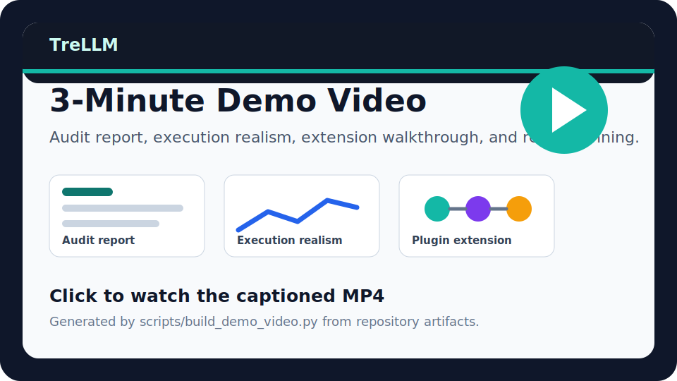
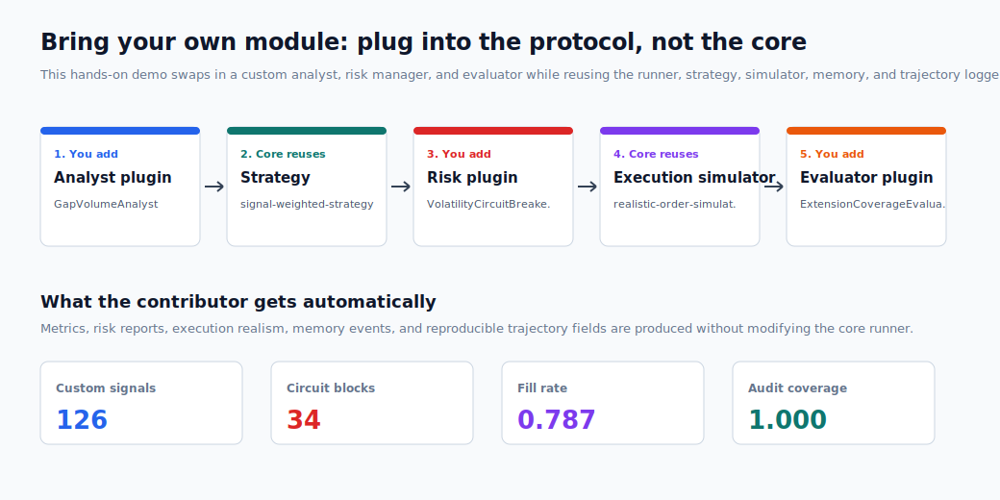

<p align="center">
  
</p>

<p align="center">
  <strong>Open-source benchmark and audit framework for evaluating LLM trading agents under realistic execution, risk, and replayability constraints.</strong>
</p>

<p align="center">
  <a href="docs/getting_started.md">Getting started</a> |
  <a href="https://github.com/weich97/TradeArena/wiki">Wiki</a> |
  <a href="https://weich97.github.io/TradeArena/">Project site</a> |
  <a href="https://weich97.github.io/TradeArena/benchmark-v0.1.html">Benchmark v0.1</a> |
  <a href="docs/demo_matrix.md">Demo matrix</a> |
  <a href="examples">Hands-on examples</a> |
  <a href="#visual-tour">Visual tour</a> |
  <a href="#research-grade-diagnostics">Diagnostics</a> |
  <a href="docs/schemas.md">Schemas</a> |
  <a href="docs/contributor_roadmap.md">Roadmap</a> |
  <a href="docs/extension_walkthrough.md">Extension walkthrough</a> |
  <a href="docs/related_work.md">Related work</a> |
  <a href="docs/technical_report.md">Technical note</a>
</p>

<p align="center">
  <a href="https://github.com/weich97/TradeArena/actions/workflows/ci.yml"></a>
  
  
  
  
  
</p>

# TradeArena

TradeArena is an open-source benchmark and audit framework for evaluating LLM
trading agents under realistic execution, risk, and replayability constraints.
It turns every trading decision into a traceable trajectory:

```text
observation -> signal -> intended allocation -> risk gate -> order
  -> fill/rejection -> portfolio state -> diagnostic report
```

TradeArena is not positioned as another "LLM trading bot." Its job is to help
researchers and engineers answer a harder question: can an LLM trading agent be
audited, reproduced, stress-tested, and constrained before anyone trusts its
headline return?

## Why TradeArena

| If you need... | TradeArena gives you... |
| --- | --- |
| Agent behavior beyond final return | Replayable observe-plan-risk-act-reflect trajectories |
| Realistic execution assumptions | Fees, slippage, latency, liquidity limits, partial fills, and rejections |
| Risk-aware evaluation | Pre-trade suitability/risk gates, in-trade monitors, post-trade attribution |
| First-run reproducibility | Quickstart showcase, tracked demo artifacts, and CI smoke tests |
| Extensibility | Narrow plugins for data, analysts, strategies, risk modules, simulators, planners, and evaluators |


## Quick Start

```bash
python -m pip install -e ".[dev]"
python scripts/run_showcase.py
```

Open:

```text
outputs/examples/index.html
```

The first-run path requires no API keys and makes no live model or
market-data calls. Advanced experiments can still use DeepSeek, Poe, Hugging Face,
AkShare, Yahoo Finance, and other provider APIs when you opt in.

Prefer to click before cloning? Open the static project site:
[`weich97.github.io/TradeArena/`](https://weich97.github.io/TradeArena/).

Try without a local install:

<p>
  <a href="https://github.com/codespaces/new?hide_repo_select=true&ref=main&repo=weich97/TradeArena"></a>
  <a href="https://colab.research.google.com/github/weich97/TradeArena/blob/main/notebooks/tradearena_5min_colab.ipynb"></a>
</p>

## What It Is Not

TradeArena does not promise profitable trading, does not provide financial
advice, and does not execute live trades by default. It is an audit and
benchmark layer for financial AI agents. The retail planning sandbox is
paper-only and requires human approval for generated rebalance instructions.

## How It Differs

| Project | Primary focus | TradeArena difference |
| --- | --- | --- |
| TradingAgents | Multi-role LLM trading workflows | TradeArena focuses on audit trajectories, risk gates, execution realism, and reproducible evaluation |
| FinRobot | Financial analysis and equity-research agents | TradeArena is a benchmark/simulation/audit layer for decision traces and execution constraints |
| FinRL | Financial reinforcement learning | TradeArena can host quant/RL-style baselines, but centers LLM agent decision chains and risk-aware replay |

For a broader non-adversarial comparison, see [`docs/related_work.md`](docs/related_work.md).

## Benchmark v0.1 Snapshot

The v0.1 result page turns the tracked artifacts into a compact benchmark claim:
LLM trading agents look different once intended allocations pass through
slippage, latency, liquidity limits, partial fills, rejected orders, and risk
gates.

- Static page: [`weich97.github.io/TradeArena/benchmark-v0.1.html`](https://weich97.github.io/TradeArena/benchmark-v0.1.html)
- Citable Markdown: [`docs/results/benchmark_v0_1.md`](docs/results/benchmark_v0_1.md)
- Rebuild command: `python scripts/build_benchmark_page.py`

The benchmark snapshot includes deterministic quickstart baselines, crisis-scene
LLM rows, 51-stock intraday portfolio probes, and representation robustness
diagnostics.

## 3-Minute Demo Video

[](https://weich97.github.io/TradeArena/demo_video.html)

The browser-playable video walks through the quickstart command, the showcase portal, the audit
report, execution realism, extension walkthrough, and retail planning sandbox.
Regenerate it locally with:

```bash
python scripts/build_demo_video.py
```

See [`docs/launch/demo_video.md`](docs/launch/demo_video.md).

## Visual Tour

The fastest way to understand TradeArena is to watch the decision loop. These
short offline-generated previews are produced from the same concepts used by the
examples: lifecycle logging, execution realism, risk feedback, and portfolio
diagnostics.

| Audit lifecycle | Execution realism | Diagnostic loop |
| --- | --- | --- |
|  |  |  |

The visual tour is deliberately small enough for a README, while the underlying
artifacts are real files produced by the repository demos and diagnostic
snapshots.

Regenerate the hands-on version locally:

```bash
python examples/visual_tour_demo.py
```

Open:

```text
outputs/examples/visual_tour_index.html
```

## Modular Extension Walkthrough

TradeArena modules connect through narrow protocols rather than hidden runner
state. The fastest contributor demo swaps in three local modules while the rest
of the framework stays fixed:

```bash
python examples/extension_walkthrough_demo.py
```

Open:

```text
outputs/examples/extension_walkthrough.svg
```

<p align="center">
  
</p>

The example contributes:

- `GapVolumeAnalyst`: emits `Signal` objects from custom market features
- `VolatilityCircuitBreakerRisk`: adds a pre-trade circuit breaker and
  auditable `RiskReport` entries
- `ExtensionCoverageEvaluator`: adds contributor-specific metrics from the
  final `Trajectory`

It reuses the existing data provider, strategy, execution agent, realistic order
simulator, memory store, reproducibility state, and trajectory logger. For the
contribution checklist, see [`docs/extension_walkthrough.md`](docs/extension_walkthrough.md).

## Retail Planning Sandbox

TradeArena can also be extended from trading-agent benchmarks into auditable
investment-planning workflows. The planning module takes an investor profile,
goals, holdings, and an asset universe, then produces suitability checks, target
allocations, futures margin estimates, and paper rebalance instructions.

```bash
python examples/retail_planner_demo.py
```

Open:

```text
outputs/examples/retail_planning_report.html
```

<p align="center">
  
</p>

The demo is deliberately conservative: no live brokerage calls, no automatic
execution, and every generated order is marked `paper_pending_human_approval`.
It includes a stock/ETF profile and an experienced futures-overlay profile so
users can inspect how the suitability gate blocks unapproved futures exposure.
See [`docs/retail_planning.md`](docs/retail_planning.md).

## Audit Report Preview

TradeArena records every step as an auditable trajectory rather than hiding the
agent inside a return curve. The rendered report links observations, analyst
signals, proposed and approved decisions, risk-gate edits, submitted orders,
fills, rejections, portfolio state, memory events, and reproducibility
fingerprints in one browser-readable artifact.

<p align="center">
  
</p>

Generate the same style of report locally:

```bash
python examples/audit_trajectory_walkthrough.py
python scripts/render_audit_report.py
```

Open:

```text
outputs/examples/audit_report.html
```

## Research-Grade Diagnostics

TradeArena is more than a toy backtester: the repository includes tracked,
offline diagnostic artifacts produced by the same trajectory, risk, execution,
and evaluation interfaces used by the framework. These examples show how an
agent's decision path can be inspected as a system object rather than reduced
to a final return number.

The current diagnostic suite highlights three research axes:

- representation signatures before agent failure
- risk-feedback alignment under true, hidden, placebo, and contrarian feedback
- mechanism probes for noise robustness, reasoning-mode ablations, and false
  audit trust calibration
- high-dimensional portfolio behavior under realistic execution constraints

| Representation signature preview | Crisis-scene trajectory probe |
| --- | --- |
|  |  |

| Market correlation vs. LLM intent | Risk-feedback calibration |
| --- | --- |
|  |  |

| Mechanism probe dashboard | 51-stock intraday portfolio probe |
| --- | --- |
|  |  |

The crisis-scene probes use timestamp-masked historical stress paths, including
a 2022 Tech/Rates drawdown scene and a 2023 SVB/regional-bank shock scene. The
tracked snapshots include redacted model metadata for GPT-family, Gemini,
Claude, and DeepSeek V4 Pro runs without shipping raw provider prompt/response
text.

The mechanism probe dashboard summarizes three stress tests that are useful for
agent evaluation: CoT-free intent geometry, noise-injection robustness, and
contrarian false-audit drift. The 51-stock intraday probe compares passive,
Markowitz/MVO, and LLM allocation behavior under a high-dimensional hourly
portfolio task, exposing concentration, risk-gate pressure, and execution-aware
return differences in a single view.

Run the gallery locally:

```bash
python examples/crisis_snapshot_demo.py
```

Open:

```text
outputs/examples/crisis_snapshot_gallery.html
```

Numeric snapshots live under [`docs/results/crisis`](docs/results/crisis) and
[`docs/results/representation`](docs/results/representation). They are small
enough to track in Git and concrete enough for new users to reproduce the
visual diagnostics without spending API credits.

## One-Command Showcase

```bash
python -m pip install -e ".[dev]"
python scripts/run_showcase.py
```

Open:

```text
outputs/examples/index.html
```

The showcase path runs without API keys or live API calls. It builds a local site linking to:

- the benchmark v0.1 result page
- an auditable trajectory report
- an animated lifecycle/execution/diagnostics tour
- an execution-realism sweep
- A-share market-rule interventions
- crisis-scene visual diagnostics
- Markowitz/MVO portfolio baselines
- representation-signature diagnostics
- a custom plugin extension example
- a contributor extension walkthrough
- a retail planning sandbox with paper rebalance instructions
- redacted LLM cache manifest metadata

## CLI Benchmark

```bash
python -m pip install -e .
tradearena --benchmark tradearena-core
```

Without installing:

```powershell
$env:PYTHONPATH='src'
python -m trading_agent_os.cli --benchmark tradearena-core --periods 60 --symbols SYN,ALT
```

## Architecture

```text
Data Layer
  OHLCV market data, synthetic/proxy news and macro,
  optional CSV sidecars for news, macro, filings, and alternative data

Agent Layer
  analyst agents, strategy agents, risk managers, execution agents,
  portfolio managers

Tool Layer
  backtester, feature store, portfolio optimizer, risk calculator,
  realistic order simulator

Risk Layer
  RiskBudget, pre-trade gate, in-trade monitor, post-trade attribution,
  violation logging, structured RiskReport logs

Logging and Evaluation Layer
  trajectories, audit manifests, return metrics, risk metrics,
  behavioral metrics, execution realism metrics, reasoning consistency
```


## Hands-On Examples

```bash
python examples/quickstart_core_benchmark.py
python examples/audit_trajectory_walkthrough.py
python scripts/render_audit_report.py
python examples/execution_realism_sweep_demo.py
python examples/portfolio_markowitz_demo.py
python examples/custom_plugin_demo.py
```

See [`examples/README.md`](examples/README.md) and
[`docs/demo_matrix.md`](docs/demo_matrix.md) for the full demo map.

## Data Adapters

TradeArena's stable data boundary is normalized OHLCV CSV:

```text
Data source -> Date,Open,High,Low,Close,Volume CSV -> CsvMarketDataProvider
```

A-share data can be downloaded through the optional AkShare bridge:

```bash
python -m pip install -e ".[ashare]"
python scripts/download_akshare_ashare_daily.py --symbols 600519.SS,300750.SZ --start 2021-01-01 --end 2026-05-14 --output-dir data/real/akshare_ashare_daily
```

Then reuse the same benchmark stack:

```bash
python -m trading_agent_os.cli --benchmark tradearena-core --data-source csv --real-data-dir data/real/akshare_ashare_daily --symbols 600519.SS,300750.SZ --real-max-periods 80
```

## LLM And Cache Policy

Live model and data calls are optional. The offline demos use deterministic agents,
tracked market data, and redacted cache manifests. If you run live model-backed
experiments, raw prompt/response JSONL caches are ignored by Git:

```text
data/llm_cache/*.jsonl
```

Build shareable redacted manifests with:

```bash
python scripts/build_llm_cache_manifest.py
```

## Development Direction

TradeArena is designed to grow through plugins and benchmarks rather than a
single fixed pipeline. See [`docs/contributor_roadmap.md`](docs/contributor_roadmap.md)
for the contribution routes. Near-term extension areas include:

- more data bridges for equities, A-shares, crypto, prediction markets, news,
  filings, macro, and alternative data
- richer execution simulators, including limit-order-book style queues,
  corporate-action calendars, venue-specific rules, and stress liquidity
- stronger baseline libraries spanning deterministic policies, Markowitz/MVO,
  reinforcement learning, and model-backed agents
- broader risk protocols covering pre-trade gates, in-trade monitors,
  post-trade attribution, human audit labels, and adversarial feedback tests
- community benchmark tasks with shareable redacted trajectories and compact
  result manifests

## Contributing

Start with [`examples/custom_plugin_demo.py`](examples/custom_plugin_demo.py) if
you want to add a new analyst, strategy, risk gate, simulator, memory store, or
metric. See [`CONTRIBUTING.md`](CONTRIBUTING.md) and
[`docs/contributor_roadmap.md`](docs/contributor_roadmap.md).

Before opening a pull request:

```bash
python -m compileall src scripts examples tests -q
python -m pytest tests -q
python scripts/run_showcase.py --reuse-existing
python scripts/check_release_readiness.py
```

## Disclaimer

TradeArena is a research and engineering framework. It is not financial advice,
and it is not a live trading system.
